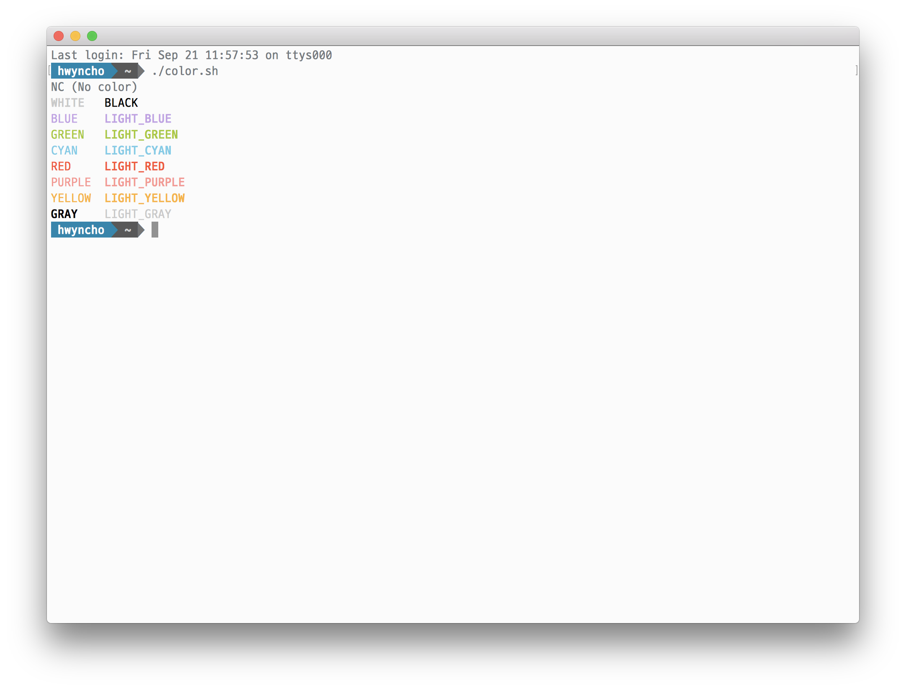
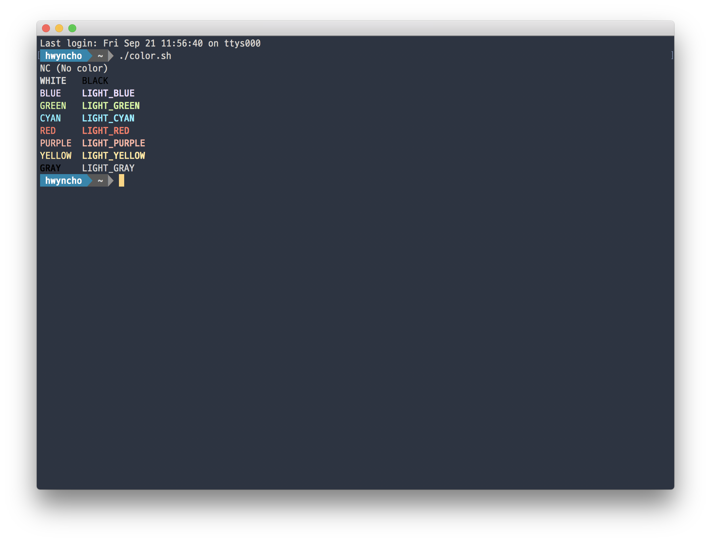
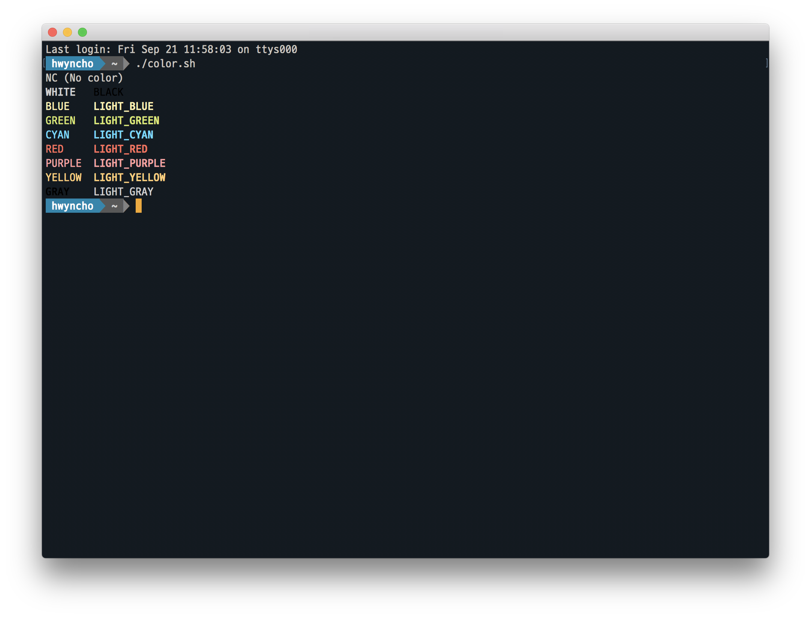

# ayu-Terminal.app

> [ayu color themes](https://github.com/ayu-theme) for [Terminal.app](<https://en.wikipedia.org/wiki/Terminal_(macOS)>)

## Screenshots

- ayu Light
  

- ayu Mirage
  

- ayu Dark
  

## How to install

1. _Terminal.app_ > Settings Tab
2. Click "Gear" icon
3. Click "Import..."
4. Select the ayu-Mirage.terminal file
5. Click "Default"
